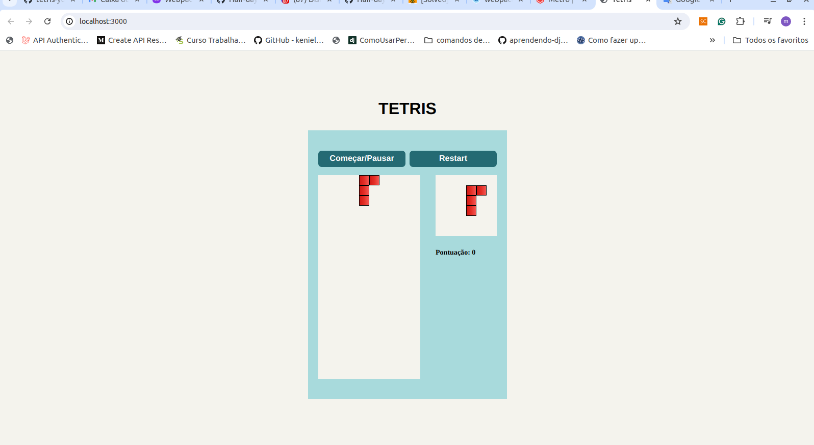
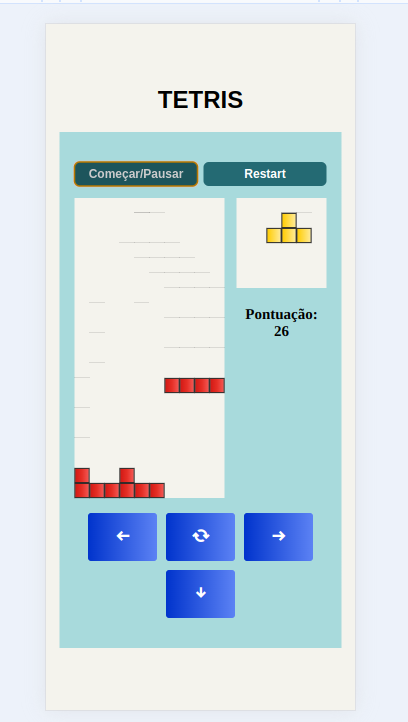

# Tetris
|||
|---|---|
|||

O Tetris é um jogo de quebra-cabeça desenvolvido por Alexey Pajitnov, lançado em 1985. Aqui o código é desenvolvido apartir do tutorial 
[Programando Tetris - Tutorial JavaScript Completo com Deploy](https://www.youtube.com/watch?v=F9AZkz9QPpA), com o objetivo de treinar 
conceitos de HTML, CSS e JS. Na branch main o código está (quase (; ) conforme o tutórial. Para rodar o jogo na branch main adicionar a extenção [live server](https://marketplace.visualstudio.com/items?itemName=ritwickdey.LiveServer) 

Na branch training-concepts brinco com conceitos mais avançados de desenvolvineto front end, configurando o webpack e separando as responsabilidades
de desenho das formas do jogo.

### Rodando o app na branch training-concepts
```bash
npm run dev
```
